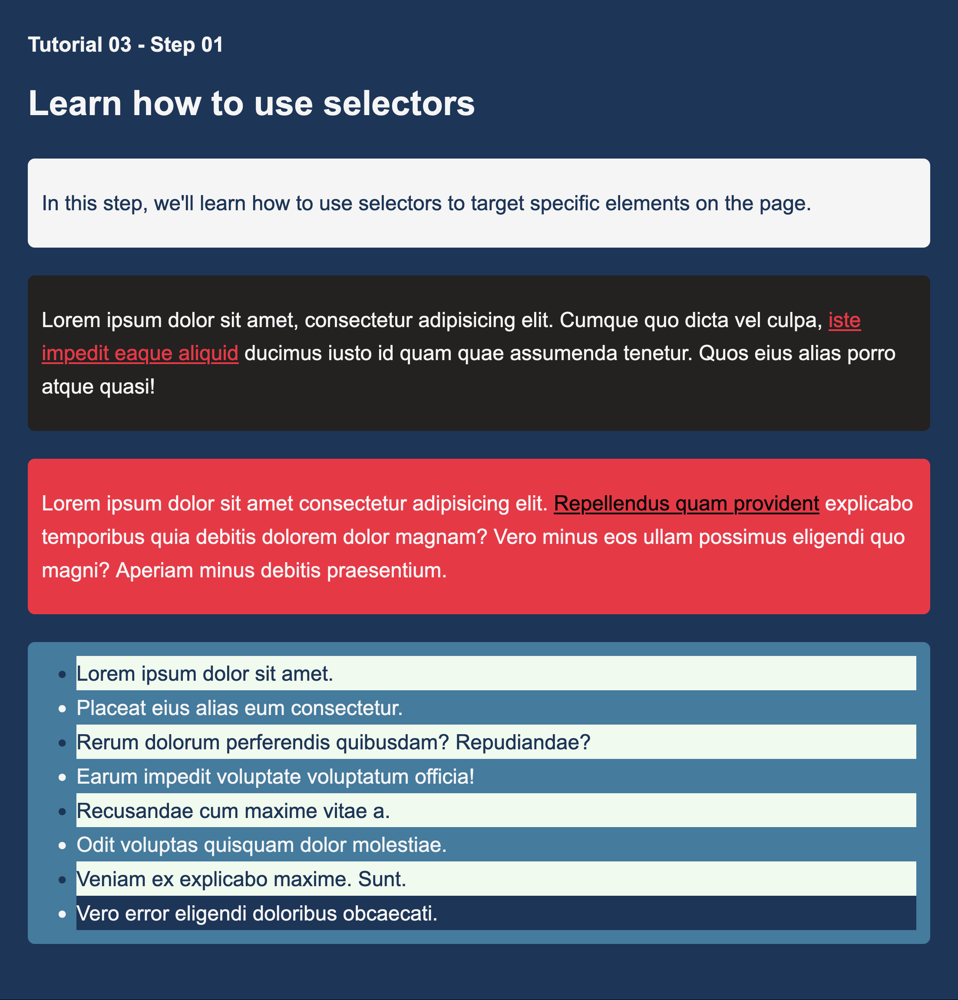
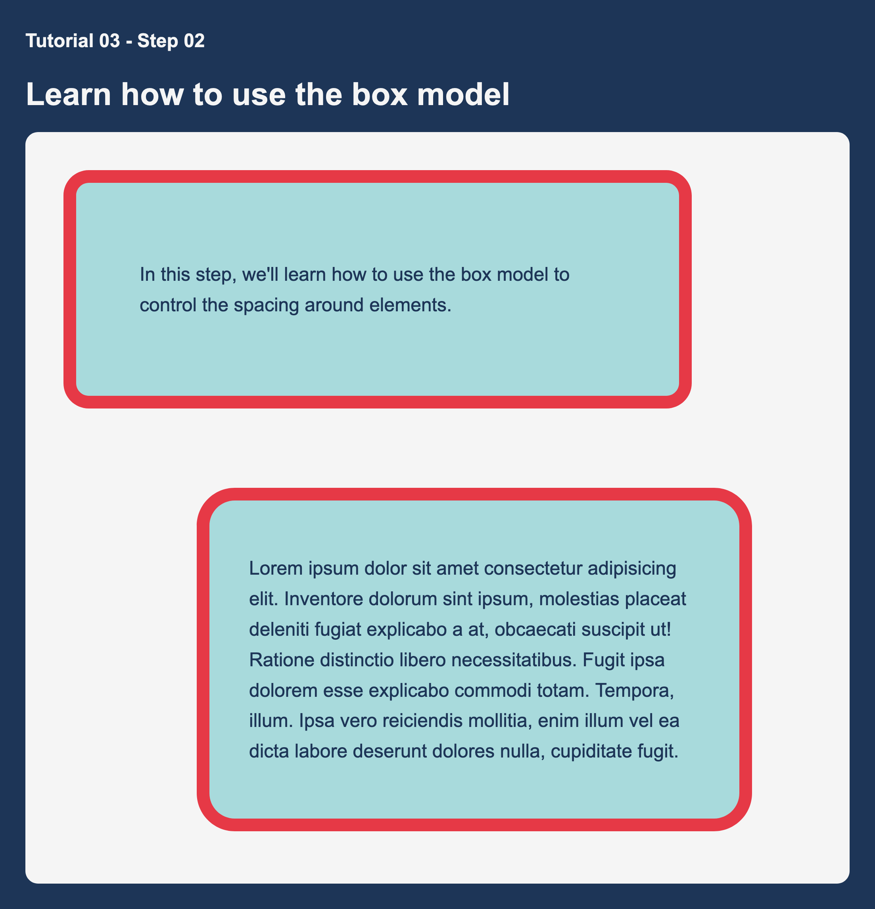

# Tutorial 03

**Course Title**: Web Development

**Course Code**: IRM1005 / ITEC1005

**Semester**: Fall 2023

**Due Date**: n/a

**Assessment**: n/a

## TLDR

1. There are three seperate style sheets that you are updating to build the three required pages (`style-01.css` `style-02.css` and `style-03.css` ). You must not modify any `HTML` for this tutorial exercise. Modify your css files, and commit the changes back to your repo.
2. Turn on GitHub Pages.
3. Submit a comment in the Tutorial Exercise 03 show and tell discussion board and share a link to your `Step 03` live web page.

## Description

The goal of this tutorial is for students to gain experience using `CSS` to add simple design elements to web pages. This includes learning about `CSS` selectors, classes, and basic `CSS` properties like `margin`, `padding`, `color`, and `background-color` to name a few.

## Table of contents

- [Instructions](#instructions)
- [Additional Help](#additional-help)
- [Final Solution Screenshots](#screenshots)
- [Helpful Links](#📚-helpful-links)

## Instructions

You must have completed `Tutorial 01` and `Tutorial 02` before attempted this exercise. The instructions below assume you have a working developer environment.

To complete this tutorial you must follow the steps below. Additional help can be found further below.

- There are three files that you are going to modify in this exercise, `style-01.css` `style-02.css` and `style-03.css`.
- Unlike other tutorial exercises, you must not modify any `HTML` files.
- Using the final solution screenshots as a reference, follow the instructions in each `CSS` files to acheive the desired results.
- `style-01.css` and `style-02.css` are simple practice exercises to get you started and `style-03.css` creates a simple coffee shop landing page.
- If you get stuck, you can use the example in the `solutions` folder for guidance
- Preview your three pages by using the LivePreview (or similiar) feature in VSCode
- Commit your changes and push to GitHub
- Turn on [GitHub Pages](https://github.com/orgs/irm1005-itec1005-fall-2023/discussions/4) in the `settings` section of your repository
- View your live web pages
- In the [Tutorial 03 - Show and Tell discussion](https://github.com/orgs/irm1005-itec1005-fall-2023/discussions/5) in our GitHub Discussion Group, add a comment with a link to your Coffee Shop (Step 03) page
- Check out some of your other team members Coffee Shop pages and make sure to tell them how awesome they are

## Additional help

### Cloning your tutorial 03 repository

Refer to the Birghtspace videos `Setting up all the things` for instructions on how to setup your local development environment and clone your tutorial repository so that you can work on your code locally.

### Activating GitHub pages

Refer to this [discussion post](https://github.com/orgs/irm1005-itec1005-fall-2023/discussions/4) for instructions on how to turn on the GitHub Pages service for your repository.

## Screenshots

### Image of Step 01

### Image of Step 02

### Image of Step 03

## 📚 Helpful links

### HTML

- [Intro to CSS - Prof3ssorSt3v3](https://www.youtube.com/watch?v=KFKScNHa-8M&list=PLyuRouwmQCjl4wTSNbb8RTKZuyMhoIxBe)
- [CSS Tutorial - MDN](https://developer.mozilla.org/en-US/docs/Web/CSS)

### GitHub

- [A short video explaining what GitHub is](https://www.youtube.com/watch?v=w3jLJU7DT5E&feature=youtu.be)
- [Git and GitHub learning resources](https://docs.github.com/en/github/getting-started-with-github/git-and-github-learning-resources)
- [Understanding the GitHub flow](https://guides.github.com/introduction/flow/)
- [How to use GitHub branches](https://www.youtube.com/watch?v=H5GJfcp3p4Q&feature=youtu.be)
- [GitHub's Learning Lab](https://lab.github.com/)
- [Education community forum](https://education.github.community/)
- [GitHub community forum](https://github.community/)

### Git

- [Interactive Git training materials](https://githubtraining.github.io/training-manual/#/01_getting_ready_for_class)
